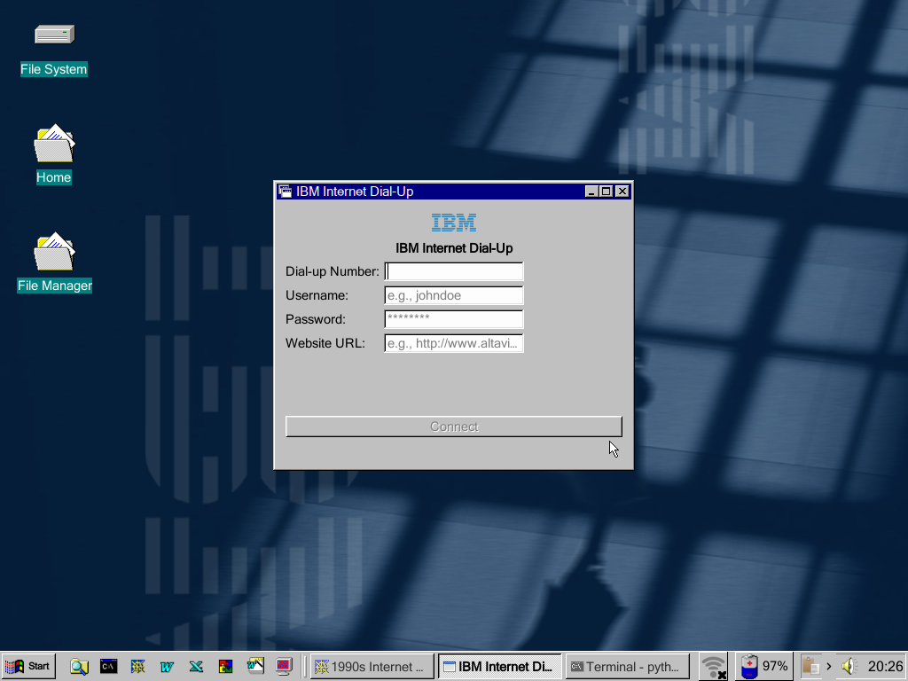

<div align="center">

# The dial up Simulator
##  A retro-style Linux app simulating 90s dial-up internet with sound and vintage UI.


<div align="center">




  
<div align="center">

##### 𝙄𝙣𝙨𝙩𝙖𝙡𝙡𝙖𝙩𝙞𝙤𝙣 🍃

```
curl -fsSL https://raw.githubusercontent.com/user7210unix/dial-up-sim/main/install.sh | bash
```
